AULA 54 – AGRUPAMENTO K-MEANS 
************

ALGORITMO DE APRENDIZAGEM K-MEANS 
=======

O algoritmo K-MEANS agrupa os dados a partir das características semelhantes. 

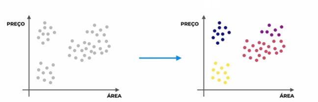

-	K-**Means**: O “Means” significa que os grupos são feitos ao redos das **médias dos valores dos dados daquele grupo. 
Por exemplo imagine o grupo roxo, nós temos a área do imóvel x preço, portanto se pegarmos a média, teremos a seguinte média:

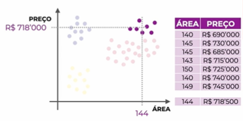

-	Centróide (“no formato de centro”): é o centro dos dados de um grupo 

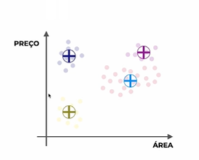

-	**K**-Means : o “K” é a quantidade de centróides

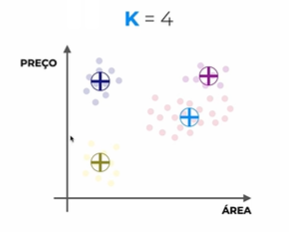

APLICAÇÕES
----
1.	Segmentação de Mercado:
Criar uma estratégia de marketing para cada grupo.

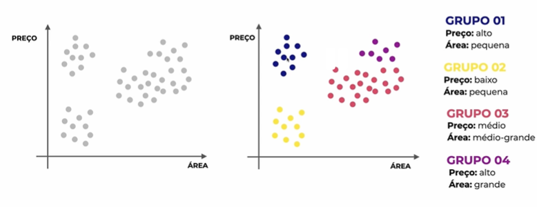

2.	Sistema de recomendação
Para cada novo usuário que entrar no site, identificar suas características e recomendar produtos do grupo em que ele pertence.

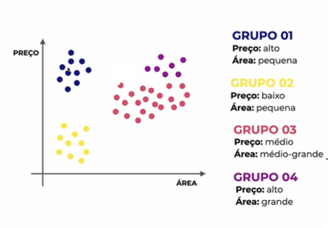

3.	Otimização de rotas:
Levando em conta a localização de cada cliente, qual seria o melhor lugar para abrir uma loja, para que o preço e o tempo de frete seja o menor possível.

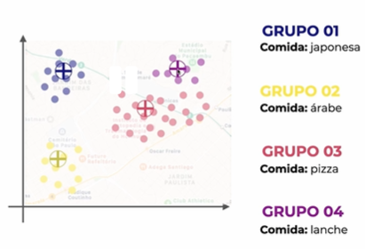

PASSO A PASSO 
=====

1.	INICIALIZAR OS CENTRÓIDES
- Definir a quantidade de centróides (K)
Para definir a melhor quantidade de centróides, analise o seu problema de negócio a analise quantos grupos são possíveis.

- Iniciar os centróides em lugares aleatórios

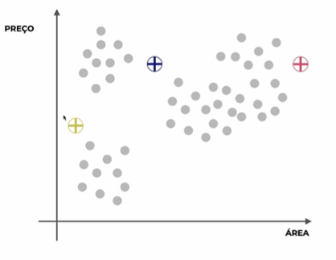

2.	ASSOCIAR CADA PONTO A UM CENTRÓIDE
- Calcular a distância de cada ponto até cada centróide
- Associar cada ponto ao centróide mais próximo

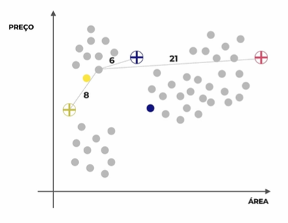

3.	REPOSICIONAR OS CENTRÓIDES
- Para cada cluster (grupo), calcular a média do valor para todos os pontos
- Colocar o centróide de cada grupo neste ponto médio

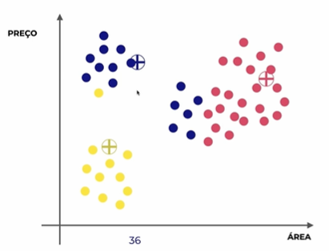

4.	REPETIR O PASSO 2 E 3
- Repetir o passo 2 e 3 até que não tenha necessidade de realocar mais nenhum centróide.

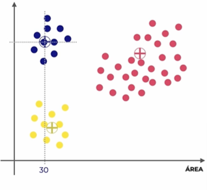

MATEMÁTICA
======

Antes de usar o K-MEANS lembre-se de deixar os dados na mesma escala pois o K-means realiza cálculos de distância.

DEPOIS DISSO A AULA CORTE E VAI PARA O PRÓXIMO VÍDEO 
