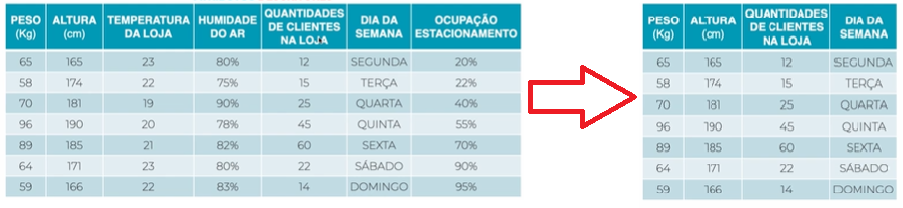
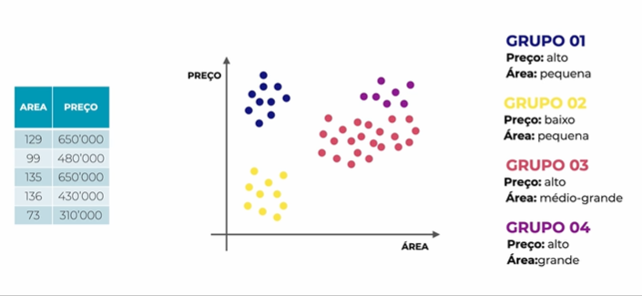

APRENDIZADO NÃO SUPERVISIONADO – AULA 53
******

Diferente do aprendizado supervisionado, no aprendizado **não** supervisionado nós temos apenas os **atributos descritores**.
Portanto com o aprendizado não supervisionado nós realizamos a tarefa de **descrever** os dados. 
Com o aprendizado não supervisionado nós podemos realizar algumas tarefas como:

1. REDUÇÃO DE DIMENSIONALIDADE
=======

Trata de diminuir as colunas (atributos descritores) do nosso DataFrame para aumentar a assertividade do algoritmo

2. REGRAS DE ASSOCIAÇÃO
=====

Analisar dados e encontrar regras do tipo **“SE...ENTÃO...”**.
Muito utilizado em sistema de recomendação para filmes, comércio eletrônico, etc.

3. TAREFA DE AGRUPAMENTO
=====

**Descrever** os dados **criando grupos** com características similares.

