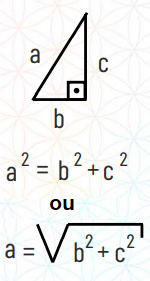
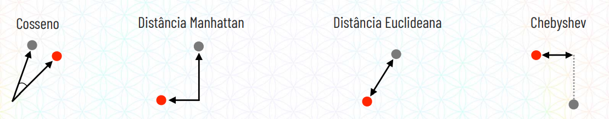
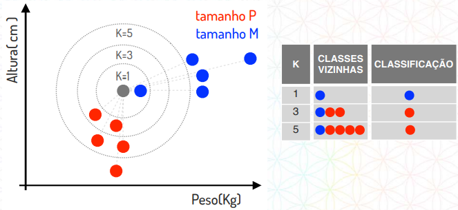

APRENDIZADO SUPERVISIONADO
********************

01.O QUE É APRENDIZADO SUPERVISIONADO
=======

Aprendizado supervisionado é quando na hora de treinar o modelo de Inteligência Artificial é fornecido as respostas do atributo alvo. 

Exemplo:

Imagine que nós temos dois atributos descritivos, ou seja, dois atributos que descrevem como chegar no atributo alvo:
 
- 01. Peso da pessoa

- 02. Altura da pessoa

.. figure::  altura_peso.png
   :align:   center

Com esses dados queremos descobrir o **tamanho da calça**

.. note::

  Neste exemplo, o tamanho da calça é nosso atributo alvo, ou seja, o atributo que queremos predizer.

Imagine que na hora de treinar o modelo de Inteligência Artificial nós vamos e supervisionamos o aprendizado dela, como um professor faria. 

Portanto dizemos que para 55KG e 155cm o tamanho da calça é P, que para 56KG e 155cm o tamanho da calça é P e assim por diante, até completar nossa base de teste. 

Ou seja, neste exemplo de aprendizado supervionado, na hora de treinar o modelo, nós entregamos os atributos descritivos e a resposta do atributo alvo. 
Desta maneira, na hora de treinar o modelo, o algoritmo irá reconhecer os padrões que existem entre peso e altura e irá conseguir predizer uma classe, se é P, M ou G quando fornecermos um dado que não temos a resposta do atributo alvo.

Vocabulário
-----

Por conta de uma questão de vocabulário:

01. Os atributos descritivos estão organizados no que chamamos de matriz.

.. figure::  atributo_descritivo.png
   :align:   center

02. O atributo alvo é organizado no que chamamos de vetor.

.. figure::  atributo_alvo.png
   :align:   center
   

02.TAREFAS DE APRENDIZADO SUPERVISIONADO
============

Com o aprendizado supervisionado podemos realizar duas tarefas:

1. Classificação 

2. Regressão

   
Quando queremos predizer uma classe o nosso atributo alvo é justamente uma classe. 

.. figure::  predizer_classe.png
   :align:   center

Quando queremos predizer um número nosso atributo alvo é justamente um número 

.. figure::  predizer_numero.png
   :align:   center
 
03.ALGORITMOS DE UMA TAREFA APRENDIZADO SUPERVISIONADO.
========

Dentro do aprendizado supervisionado temos duas tarefas:

03.a.CLASSIFICAÇÃO 
----

Dentro da tarefa de classificação nós temos os algoritmos:

03.a.i.K-NN
-----

**K-NN** vem do inglês que significa *"K-Nearest Neighbors"* ou seja, **"K-Vizinhos mais Próximos"**,  é o algoritmo de aprendizagem mais simples de machine learning. Ele funciona calculando a distância entre dois pontos:

Exemplo:

Dado que temos dois atributos descritivos, peso e altura, e o nosso atributo alvo é o tamanho da calça

Nós forcenemos esses dados para o algoritmo K-NN e ele irá se moldar, ou seja, virar um modelo, que, quando forcermos um dado sem o atributo alvo

.. figure::  atributo_alvo.png
   :align:   center
   
Ele começa a calcular a distância entre os pontos mais próximos, daí que vem o nome **K-Vizinhos mais Próximos**.

.. note::

   Esse "K" é a quantidade de vizinhos que vamos levar em consideração, como no exemplo acima levamos em consideração os 5 vizinhos mais próximos, e 4 deles eram vermelho, ou seja, tamanho P, então o modelo definiu que o novo dado é P.

03.a.ii.CÁLCULO DE DISTÂNCIA
-----

Vale a pena ressaltar que aqui só será explicado um dos cálculos de distância para você entender o funcionamento do algoritmo, até porque você não irá precisar fazer essas contas, o computador irá fazer para você em poucas linhas de código no jupyter notebook.

OBS: NO EXEMPLO APRESENTADO EM AULA, FOI APRESENTADO SEM ESCALONAR OS DADOS, VALIDAR SE SERÁ ASSIM MESMO PARA FACILITAR O ENTENDIMENTO DO ALUNO. 

03.a.iii.TRIÂNGULO RETÂNGULO
------

Existe um tipo de triângulo chamado triângulo retângulo que tem uma particularidade que um dos ângulos é de 90 graus.

Chamamos o lado contrário ao ângulo de 90 graus, em nosso exemplo a linha **a** do triângulo, de hipotenusa.
E para descobrir o tamanho da hipotenusa, em nosso exemplo, a linha **a** do triângulo, nós usamos a seguinte fórmula:

Podemos escrever essa equação também da seguinte forma:

EXEMPLO:

Imagine o seguinte triângulo:

Para descobrir o valor de **a** faremos da seguinte forma:

03.a.iiii.APLICANDO O CÁLCULO NO K-NN
-----

Retomando ao nosso gráfico imagine que temos:

Uma pessoa com 65kg e 165cm que veste calça do tamanho P

Uma pessoa com 67kg e 185cm que queremos classificar

.. note::

  Repare que essa distância entre pontos  justamente o cálculo da hipotenusa que mostramos

Para resolver esse cálculo de distância basta substituir o valor de b e de c e realizar o cálculo:

Portanto a distância entre esses dois pontos é de 20,09, porém não precisa se preocupar em realizar essas contas, o algoritmo irá fazer para a gente.

O nome desse cálculo de distância é a Distância Euclidiana.
O K-NN trabalha com diferentes tipos de cálculo de distância.

A melhor distância a se utilizar depende dos seus dados e do seu problema de negócio

03.a.iv.APLICANDO O CÁLCULO NO K-NN
-----

Imagine que você tem os atributos descritivos peso e altura e quer predizer o atributo alvo **tamanho da calça** de uma pessoa de 67kg e 180cm

Na hora de treinar o modelo o algoritmo irá calcular aquelas distâncias entre os pontos.

O segundo momento é nós elegermos qual a quantidade de vizinhos para fazer essa classificação. Pos a **maioria das classes dos vizinhos irá ditar a nossa classificação.** 

Ou seja, quando o K, que é a quantidade de vizinho, for 1, ele irá pegar só o primeiro vizinho mais próximo, que no nosso caso é o tamanho M. 

Quando o K for igual a 3, ele irá pegar os 3 vizinhos mais próximos, como a maioria desses 3 é vermelho, ou seja, tamanho P, a nossa classificacão também será tamanho P.

O mesmo vale para quando o K for igual a 5. 

.. note::

   Em nosso exemplo só usamos os valores de K igual a números ímpares, porém no caso de K for um número par, e as classes estiverem equilibradas, 2 azuis e 2 vermelhos por exemplo, o que irá ditar a classificação é a qual dessas duas classes está mais próximo.

03.C.REGRESSÃO
-----

(PULA ESSA PARTE NO RTD, VOU FAZER SEMANA QUE VEM)
