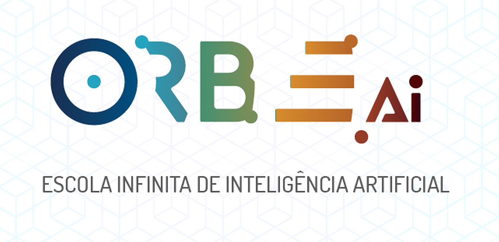

____________________________________________________________

QUANDO VOCÊ ENTRA EM ÓRBITA COM A GENTE...
==========================================
..começa a experimentar uma jornada de **aprendizado contínuo baseada em projetos** partindo de um ponto inicial que requer zero programação, ou seja, sem nenhum conhecimento prévio! 

Desenvolvemos a Orbe para todos. 
**Nossa missão é despertar o potencial humano através da Inteligência Artificial** enquanto utilizamos como ferramentas a programação e a matemática. 

Dessa forma fica muito mais leve, fácil e prático aprender. 

____________________________________________________________

Conteúdos
--------

.. toctree::
   :caption: METODOLOGIA
   :maxdepth: 1

   metodologia

.. toctree::
   :caption: PYTHON
   :maxdepth: 1

   python_introducao
   python_dados
   python_estrutura_dados
   python_estrutura_condicao
   python_estrutura_repeticao
   python_funcao
   python_ficha_resumo

.. toctree::
   :caption: PANDAS
   :maxdepth: 1
   
   pandas_introducao
   pandas_compreensao_dados
   pandas_tratamentos_dados
   
.. toctree::
   :caption: GRAFICOS
   :maxdepth: 1
   
   matplotlib_introducao
   matplotlib_linha
   matplotlib_barra
   matplotlib_histograma

.. toctree::
   :caption: MACHINE LEARNING
   :maxdepth: 1 
   
   machine_learning
