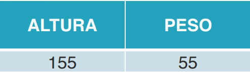
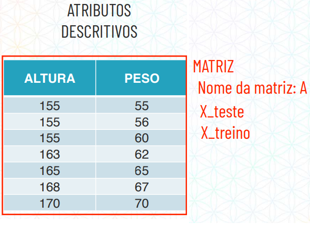
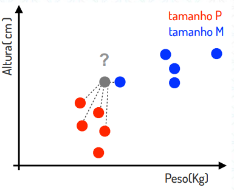
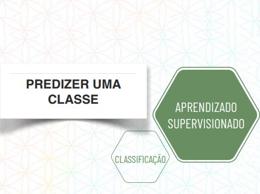
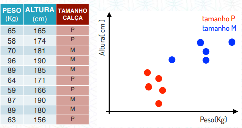
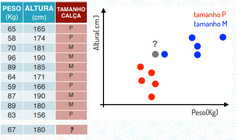
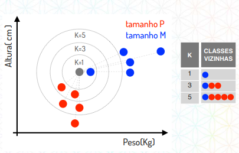

APRENDIZADO SUPERVISIONADO
********************

01.O QUE É APRENDIZADO SUPERVISIONADO
=======

Aprendizado supervisionado é quando na hora de treinar o modelo de Inteligência Artificial é fornecido as respostas do atributo alvo. 

Exemplo:

Imagine que nós temos dois atributos descritivos, ou seja, dois atributos que descrevem como chegar no atributo alvo:
 
- 01. Peso da pessoa

- 02. Altura da pessoa

Com esses dados queremos descobrir o **tamanho da calça**

.. note::

  Neste exemplo, o tamanho da calça é nosso atributo alvo, ou seja, o atributo que queremos predizer.

Imagine que na hora de treinar o modelo de Inteligência Artificial nós vamos e supervisionamos o aprendizado dela, como um professor faria. 

Portanto dizemos que para 55KG e 155cm o tamanho da calça é P, que para 56KG e 155cm o tamanho da calça é P e assim por diante, até completar nossa base de teste. 

.. figure::  altura_peso_completo.png
   :align:   center

Ou seja, neste exemplo de aprendizado supervionado, na hora de treinar o modelo, nós entregamos os atributos descritivos e a resposta do atributo alvo. 
Desta maneira, na hora de treinar o modelo, o algoritmo irá reconhecer os padrões que existem entre peso e altura e irá conseguir predizer uma classe, se é P, M ou G quando fornecermos um dado que não temos a resposta do atributo alvo.

Vocabulário
-----

Por conta de uma questão de vocabulário:

01. Os atributos descritivos estão organizados no que chamamos de matriz.

02. O atributo alvo é organizado no que chamamos de vetor.

   

02.TAREFAS DE APRENDIZADO SUPERVISIONADO
============

Com o aprendizado supervisionado podemos realizar duas tarefas:

1. Classificação 

2. Regressão

.. figure::  tarefa_aprendizado_supervisionado.png
   :align:   center
   
Quando queremos predizer uma classe o nosso atributo alvo é justamente uma classe. 

Quando queremos predizer um número nosso atributo alvo é justamente um número 

.. figure::  predizer_numero.png
   :align:   center
 
03.ALGORITMOS DE UMA TAREFA APRENDIZADO SUPERVISIONADO.
========

Dentro do aprendizado supervisionado temos duas tarefas:

03.a.CLASSIFICAÇÃO 
----

Dentro da tarefa de classificação nós temos os algoritmos:

03.a.i.K-NN
+++++

COMPLEMENTAR ESTA PARTE COM O CONTEÚDO DA AULA 40.

**K-NN** vem do inglês que significa *"K-Nearest Neighbors"* ou seja, **"K-Vizinhos mais Próximos"**, ele funciona da seguinte forma:

Imagine que temos um gráfico de peso x altura e dentro desse gráfico nós temos um ponto onde o peso é de 65kg e a altura é de 165cm e com o aprendizado supervisionado vamos classificando esses pontos em tamanho P ou tamanho M.

Assim fazemos até disponibilizar uma quantidade de dados 

Quando obtermos um dado onde não temos o atributo alvo, como uma pessoa de 89kg e 185cm e queremos descobrir qual o tamanho da calça.

Para isso o K-NN, ou seja, **K-Vizinhos mais Próximos**, parte do pressuposto que os pontos mais próximos são mais parecidos, dependendo da quantidade de vizinhos que você escolher.

03.b. **REGRESSÃO**

(PULA ESSA PARTE NO RTD, VOU FAZER SEMANA QUE VEM)
