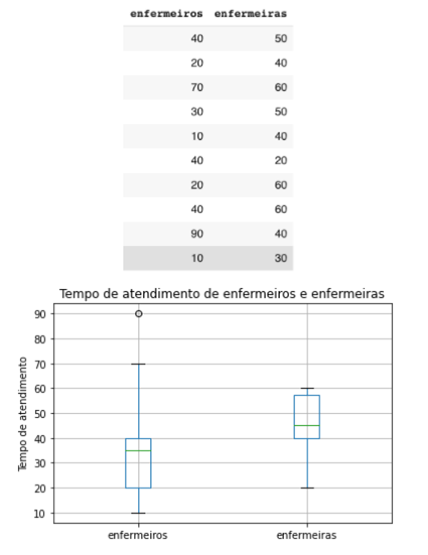
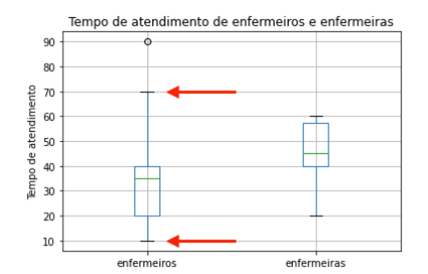
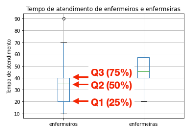
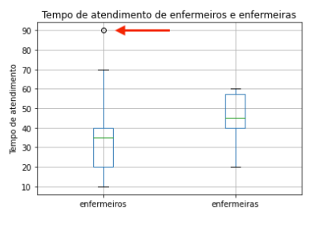
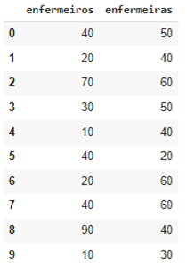
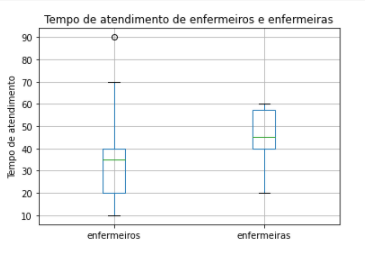
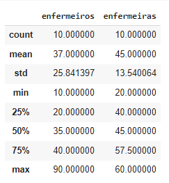

GRÁFICO BOXPLOT.
**********

O boxplot nos permite visualizar a **distribuição de uma variável (coluna do DataFrame) numérica**.

 
01.MEDIDAS ESTATÍSTICAS OBSERVADAS NO BOXPLOT.
========

Em um boxplot os dados da variável (coluna do DataFrame) estão ordenados no menor para o maior valor.

01.a.AMPLITUDE.
-----

Em um boxplot podemos observar a amplitude de uma variável numérica, ou seja, o valor máximo e mínimo.

•	Graficamente os valores máximos e mínimos são representados por duas linhas fora da caixa retangular.
•	Estes valores máximos e mínimos também são chamados de ``whiskers`` e qualquer valor fora deles pode ser considerado ``um outlier``, ou seja, um valor discrepante/muito diferente dos demais.

 
01.b.QUARTIS.
-------

Os quartis são três pontos (Q1, Q2, Q3) que dividem o conjunto de dados ordenados em quatro partes:

•	Q1 (primeiro quartil): 25% das observações.

•	Q2 (segundo quartil): 50% das observações.

•	Q3 (terceiro quartil): 75% das observações.

.. note:: 
   
   O Q2 é a mediana.
   
   Vocabulário: lembrando que “observação” é um outro nome para “entradas” e “linhas do DataFrame”.

 
02.c.OUTLIERS.
===== 

•	Os ``outliers`` são valores discrepantes, ou seja, muito diferentes de todos os valores do conjunto de dados.

•	Geralmente os ``outliers` são produzidos por algum erro na coleta dos dados como um equipamento danificado ou até mesmo um erro de digitação.

•	Geralmente os ``outliers` costumam exercer influência negativa na análise e resultados de um processo de ciência de dados e por isso é recomendável tratá-los.

Esta é um dos pontos de importância do boxplot na etapa de compreensão dos dados em um projeto de ciência de dados.

   
03.COMO CONSTRUIR UM BOXPLOT.
=======

03.a.IMPORTANDO AS BIBLIOTECAS NECESSÁRIAS.
------

.. code-block:: python
   :linenos:
   
   #Importando as bibliotecas necessárias
   import pandas as pd
   import matplotlib.pyplot as plt

03.b.CRIANDO O DATAFRAME.
------

Vamos criar um DataFrame com dados de tempo de atendimento para enfermeiros e enfermeiras:

.. code-block:: python
   :linenos:
   
   #Criando o DataFrame:
   df = pd.DataFrame({
     'enfermeiros': [40,20,70,30,10,40,20,40,80,10],
     'enfermeiras': [50,40,60,50,40,20,60,60,40,30]
   })

.. code-block:: python
   :linenos:
   
   #Visualizando o DataFrame
   df.head(10)
   
**Este é o resultado:**

 
03.c.CONSTRUINDO O BOXPLOT.
-------

Para construirmos o boxplot usamos o método ``boxplot()`` da biblioteca Pandas junto com os objetos figure e axes da biblioteca Matplotlib desta forma:

.. code-block:: python
   :linenos:

   #Criar os objetos figure e axes
   fig, ax_01 = plt.subplots()

.. code-block:: python
   :linenos:
   
   #Criar o boxplot
   df.boxplot(['nome das colunas'], ax = ax_01)

.. code-block:: python
   :linenos:
   
   #Customizar o boxplot
   ax_01.set_title("Tempo de atendimento de enfermeiros e enfermeiras")
   ax_01.set_ylabel("Tempo de atendimento")

**Este é o resultado:**

03.d.MÉTODO ``describe()``.
-------

A biblioteca Pandas possui o método ``describe()`` que descreve as medidas estatísticas mais usadas e que a maioria pode ser observada no boxplot.

.. code-block:: python
   :linenos:
   
   #Método describe()
   df.describe()

**Este é o resultado:**

