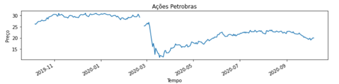
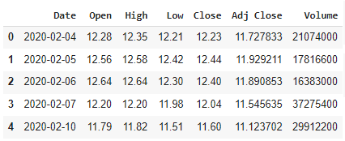
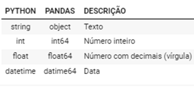
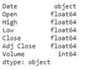
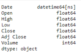
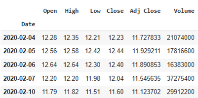
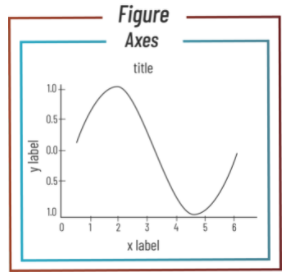
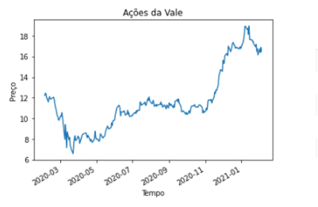

GRÁFICO DE LINHAS
********

 
01.PARA QUE SERVE UM GRÁFICO DE LINHAS.
=====

•	Usamos um gráfico de linha **quando os dados possuem uma continuidade**. 
Geralmente tempo, que fica no eixo X (eixo horizontal).

 
02.PREPARANDO OS DADOS.
=======

02.a.IMPORTANDO AS BIBLIOTECAS NECESSÁRIAS.
--------

.. code-block:: python
   :linenos:
   
   #Importando as bibliotecas necessárias
   import pandas as pd
   import matplotlib.pyplot as plt

02.b.CRIANDO O DATAFRAME
-------

Criaremos o objeto DataFrame a partir de um dataset de os valores das ações na bolsa de valores e que pode ser encontrado no site do Yahoo! Finanças.

.. code-block:: python
   :linenos:
   
   #Criando o DataFrame
   df_vale = pd.read_csv("/content/VALE.csv")
   
.. code-block:: python
   :linenos:
   
   #Visualizandoo DataFrame
   df_vale.head()
   
   
**Este é o resultado:**

  

 
2.c.PREPARANDO O DATAFRAME PARA O GRÁFICO DE LINHAS.
-------

Entendendo que tipo de dado é a variável que indica tempo (neste caso a variável “Date”). Para isso usamos o comando ``dtypes`` desta forma:

.. code-block:: python
   :linenos:
   
   #Usando comando dtypes
   df_vale.dtypes
   
   
**Este é o resultado:**

 
02.c.i.ALTERANDO O TIPO DE DADO DA VARIÁVEL DE TEMPO PARA DATETIME.
--------

É muito comum os valores da variável de tempo ('Date' no nosso caso) estar formatada como texto (``object``) e por isso temos que transformá-la em um tipo de dado de tempo (``datetime64``). 

Para isso usamos o comando ``.to_datetime()`` desta forma:

•	df.Nome_Variavel = pd.to_datetime(df.Nome_Variavel)

.. code-block:: python
   :linenos:
   
   #Tranformando a columa Date em um tipo de dado datetime64
   df_vale.Date = pd.to_datetime(df_vale.Date)

.. code-block:: python
   :linenos:
   
   #Usando comando dtypes para verificar a alteração
   df_vale.dtypes
    
**Este é o resultado:**

 
02.c.ii.TORNANDO A VARIÁVEL DE TEMPO O ÍNDICE DO DATAFRAME.
------

Antes vamos visualizar as cinco primeiras entradas do Data Frame com o método ``.head( )``:

.. code-block:: python
   :linenos:
   
   #Usando comando dtypes para verificar a alteração
   df_vale.head()
    
**Este é o resultado:**

 
Transformar a variável de tempo no índice do Data Frame ajuda o Matplotlib a criar os gráficos de linha, já que os dados que estão no índex do DataFrame são os dados usados no eixo x (eixo horizontal) do gráfico. 

Para isso usamos o comando ``.set_index()`` desta forma:

.. code-block:: python
   :linenos:
   
   #Usando comando .set_index() para tranformar a coluna 'Date' no índex do DataFrame
   df_vale.set_index("Date", inplace=True)

.. code-block:: python
   :linenos:
   
   #Usando comando dtypes para verificar a alteração
   df_vale.head()
    
**Este é o resultado:**

   
03.CONSTRUINDO UM GRÁFICO DE LINHAS.
============

 

.. code-block:: python
   :linenos:
   
   #Criar objeto figure e axe
   fig, ax_vale = plt.subplots()

.. code-block:: python
   :linenos:

   #Escolher os dados e plotar o gráfico
   df.Close.plot(kind="line", ax=ax_vale)

.. code-block:: python
   :linenos:

   #Customizar o Axe
   ax_vale.set_title("Ações da Vale")
   ax_vale.set_xlabel("Preço")
   ax_vale.set_ylabel("Tempo")

.. code-block:: python
   :linenos:

   #Mostrar o gráfico
   plt.show()

**Este é o resultado:**

