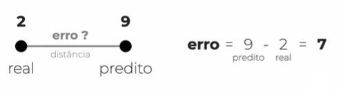

AULA  46 – MÉTRICAS DE AVALIAÇÃO PARA TAREFA DE REGRESSÃO 
************

1.	O QUE É ERRO
=====

**Erro é a diferença entre o que foi predito pelo modelo, menos o real.** 
Imagine que você vende um produto, e o algoritmo predisse que você iria vender 9 deste produto, porém você vendeu apenas 2, portanto o erro é de 7. 

Caso o erro seja negativo, por exemplo, se você vender 9 produtos mas o algoritmo predisse que venderia apenas 2, o erro é de -7; Neste caso pode usar o **módulo** ou o **quadrado** para evitar números negativos.

2.	COMO MEDIR O ERRO
====

Para medir um erro imagine o seguinte exemplo:

Para medir este erro nós usar o **erro médio quadrático** que é basicamente somar todos os erros elevados ao quadrado e dividir pela quantidade de erros que tivemos

Depois disso basta tirar a **raiz do erro medio quadrático**, ou seja, obter a raiz do resultado anterior.

