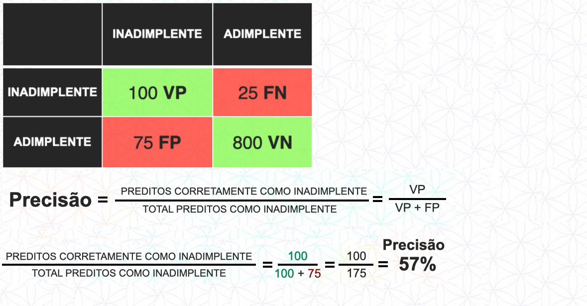

MÉTRICAS DE AVALIAÇÃO PARA MODELOS DE CLASSIFICAÇÃO
**********

01.COMO AVALIAR UM MODELO DE CLASSIFICAÇÃO
=======

01.a.CONSIDERAR O CONTEXTO
---

O primeiro passo é considerar o contexto em que se está trabalhando, por exemplo, caso o modelo classifique se a pessoa tem um determinado tipo de doença ou não, ele precisa ter uma alta taxa de acerto, pois é a vida da pessoa que está em risco.
Se for um modelo para predizer se um banco deve liberar empréstimo ou não, a taxa de acerto não precisa ser tão alta.

01.b.NÚMERO DE CLASSES
---

O segundo passo é considerar o número de classes que temos dentro da nossa base de dados, por exemplo, imagine que temos três cartas, cada uma de um naipe, podendo ser Ouros, Espadas ou Copas.

   
   
Tendo essas informações, se nós dermos um chute para descobrir qual o naipe da carta com elas viradas para baixo, temos 33% de chance de acerto.
Se a taxa de acerto do modelo for menor que 33% não vale a pena ter um modelo de Machine Learning para resolver esse problema.

02.MATRIZ DE CONFUSÃO
======

A Matriz de Confusão é uma ferramenta importante para avaliar erros e acertos do modelo, o seu nome se refere à confusão que o modelo faz ao classificar os atributos alvo.
Imagine um banco que utiliza um modelo de Machine Learning para classificar:

- Se a pessoa é INADIMPLENTE, ou seja, não paga o empréstimo

- Se a pessoa é ADIMPLENTE, ou seja, paga o empréstimo

A matriz irá funcionar da seguinte maneira:

- Em verde são as classes que a matriz ACERTOU
- Em vermelho são as classes que a matriz ERROU

. . note: : 

	- 100 clientes foram preditos CORRETAMENTE como inadimplente
	- 800 clientes foram preditos CORRETAMENTE como adimplente
	- 25 clientes foram preditos ERRADOS como adimplente, mas são inadimplente
	- 75 clientes foram preditos ERRADOS como inadimplente, mas são adimplente

02.a.NOMENCLATURA
---

A Matriz de Confusão possui cada quadrante, cada um com um nome. A lógica atrás do nome funciona da seguinte maneira:

- O modelo classificou com a classe “A”? Responda com Positivo ou Negativo
- O modelo previu corretamente? Responda com Verdadeiro ou Falso

   

02.b.MÉTRICAS DE AVALIAÇÃO
----

Levando em consideração o exemplo anterior nós podemos chegar na seguinte conclusão:

02.b.i.TAXA DE ACERTO
+++++

Para calcular a acurácia, ou seja, a taxa de acerto, nós fazemos os ACERTOS dividido pelo TOTAL, em nosso caso será:

02.b.ii.PRECISÃO
+++++

Para calcular a precisão nós fazemos as classes preditas como VERDADEIRA POSITIVO dividido por VERDADEIRO POSITIVO + FALSO POSITIVO, em nosso exemplo será:

   

03.MÉTRICAS DE AVALIAÇÃO
====

ESSA PARTE PRECISA CORRIGIR NA AULA.
