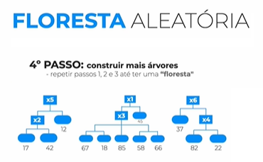

AULA 1 -  TAREFA DE REGRESSÃO
********

1.	APRENDIZADO DE MÁQUINA
======

**Aprendizado** é usar estatística para entender os dados e tomar a melhor decisão.
**Computador** para fazer as contas de estatística. 

2.	APRENDIZADO SUPERVISIONADO
======

Usar estatística para entender os dados e tomar a melhor decisão com a supervisão, com o aprendizado supervisionado podemos realizar a classificação que vimos anteriormente e a regressão.

3.	TAREFA DE REGRESSAO
======

Tarefa de regressão é a tarefa de predizer um número. 

4.	ALGORITMOS DE APRENDIZAGEM
=====

Algoritmo é um passo a passo usando estatística para realizar uma tarefa, em nosso caso, a de predizer números, para isso temos diferentes passos a passos que são:

**-Regressão linear**
-----

Lembrando que o algoritmo irá aprender com nossos dados e se tornará um modelo, visualmente falando esse modelo de regressão linear é uma reta, onde quando entrar um novo atributo alvo, iremos buscar na reta onde ele está localizado.

   

   
   
**Tipos de correlação**
++++

Para o algoritmo de regressão linear nós temos três tipos de correlação:

- Correlação positiva que é quando se aumenta o ponto x, o ponto y necessariamente aumenta também e vice-versa

- Correlação nula, onde não existe correlação entre os pontos

- Correlação negativa, que é quando se aumenta o ponto x, o ponto y necessariamente diminui, e vice-versa.

Mas lembre-se! **Correlação NÃO é causualidade!** Ou seja, não é porque duas ou mais variáveis estão correlacionadas que elas necessariamente são a causa uma da outra! 

**- Arvore de decisão**
-----

O modelo visualmente falando do algoritmo árvore de decisão é justamente uma árvore onde é separado em raiz (começo da árvore), depois os nós que são perguntas e as folhas que são as respostas.

.. figure::  arvore_segundo_passo.png
   :align:   center

**-Floresta aleatória**
----

.. figure::  floresta_aleatoria.png
   :align:   center

Floresta aleatória é um conjunto de árvores de decisões

   

   

   

   
   

