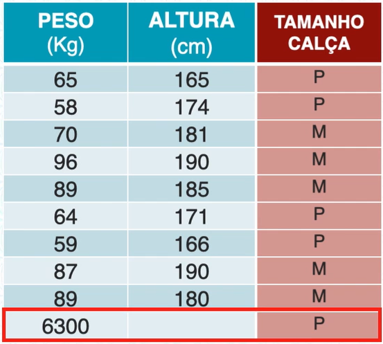
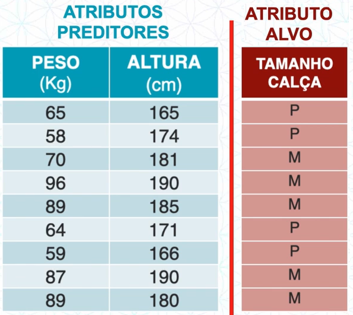
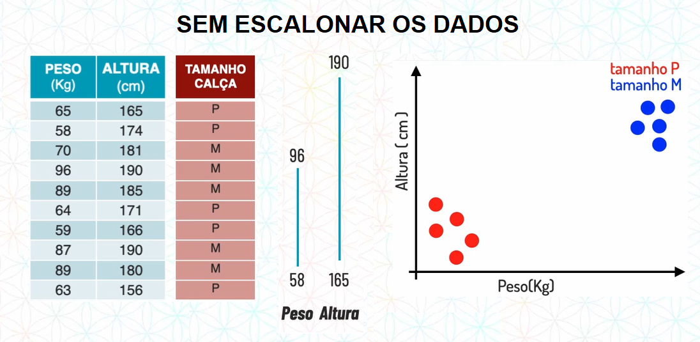
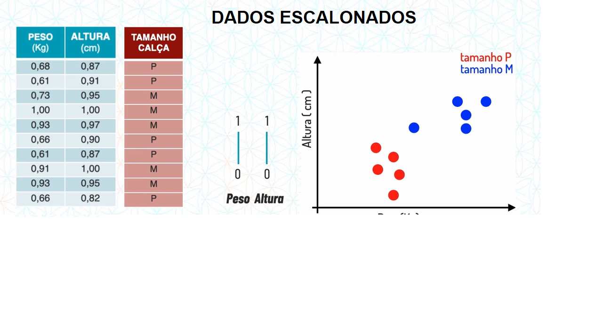
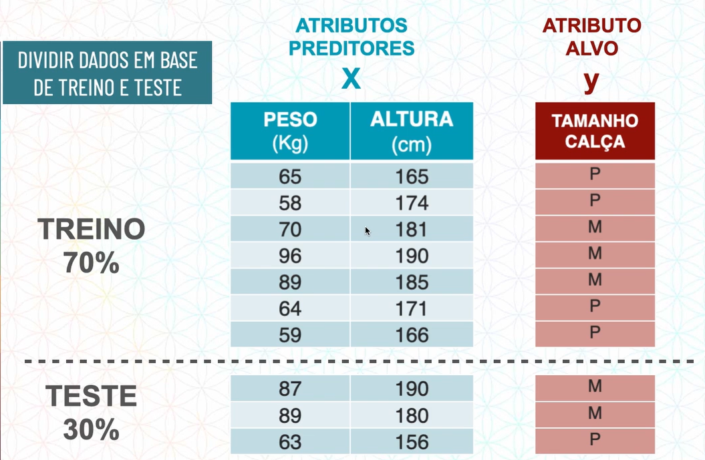
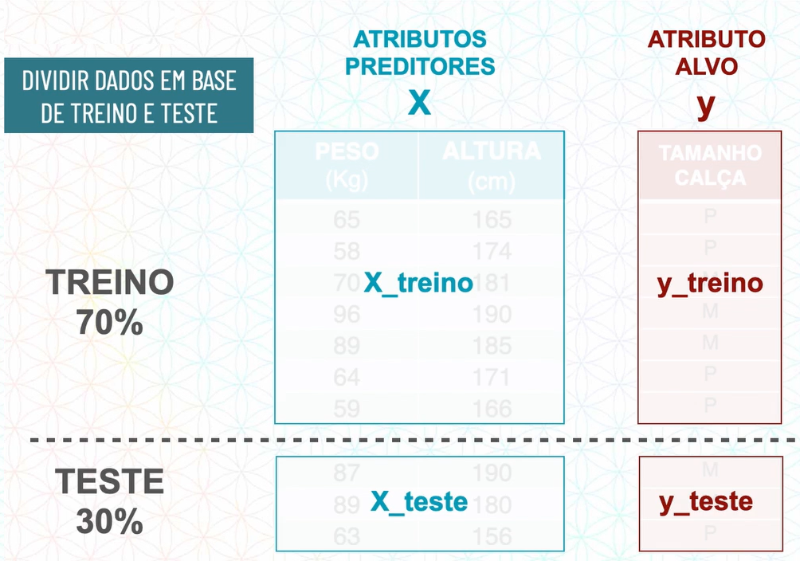
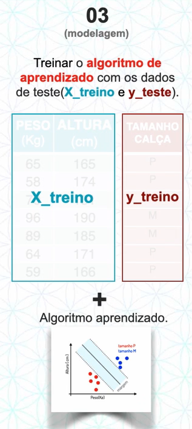
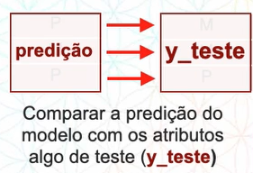
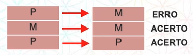

TREINAMENTO DE UM MODELO DE CLASSIFICAÇÃO
********************

01.PREPARAÇÃO DOS DADOS
========

01.a Tratar os Dados (valores)
-----

Muitas vezes podemos ter valores errados ou ausente, como no exemplo da tabela abaixo onde temos uma pessoa de 6300KG e sem atura registrada.

A primeira opção que temos é **apagar os dados** porém não é recomendado pois perdemos alguns dados importantes.

Outra opção é substituir os dados ausentes com valores da média, moda e mediana. 

01.b.SEPARAR ATRIBUTOS PREDITORES E ATRIBUTOS DO ALVO
----------

O próximo passo é separar as colunas que temos entre:

* Atributos preditores ou descritores, que são aqueles que nos ajudam a descrever o atributo alvo. 

* Atributo alvo, ou seja, aquele atributo que queremos descobrir.

01.c.ESCALONAR OS ATRIBUTOS PREDITORES
--------

Escalonar os atributos preditores significa torná-los em uma mesma escala.

Imagine o exemplo abaixo onde temos:

Repare que entre no atributo peso o menor valor é 58 e o maior 96, enquanto em altura, o menor valor já começa com 165 e o maior é 190. Essa distância pode ser um problema para algoritmos como o K-NN, que calcula a distância entre pontos.

Ao colocarmos em uma escala veja como fica:

   
.. note::

  Repare como a distância entre os pontos mudou, dessa forma a classificação em algoritmos que trabalham com distância entre pontos, fica muito mais precisa.

01.d.DIVIDIR EM BASE DE TREINO E TESTE
------

Fizemos a primeira divisão que é separar em atributos preditores e atributo alvo, agora faremos uma segunda divisão que é separar em base de treino e base de teste. 

Nesse momento a ideia é no treinamento do modelo de um aprendizado supervisionado fornecermos a base de treino com atributos preditores e atributos alvo e depois na hora de avaliar o modelo, fornecer da base de teste somente os atributos preditores.

Existem técnicas para saber qual % usamos na base de treino e na base de teste, porém o usual é ser 70% para treino e 30% para teste, por uma questão de nomenclatura chamamos da seguinte forma:

02.MODELAGEM (treinamento de um modelo)
=======

Modelagem é quando adicionamos a nossa base de treino o algoritmo de aprendizado

O algoritmo irá aprender com os atributos descritivos qual é o passo a passo para chegar no atributo alvo.

Depois que ele aprender com estes dados, ele irá se modelar, ou seja, virar um molde.
Quando colocarmos novos atributos descritivos, sem o atributo alvo, ele irá realizar a predição.

03.AVALIAÇÃO DO MODELO
======

Após a modelagem do modelo, vamos avaliar o desempenho com os dados de treino. 

A avaliação consiste em fornecer para o modelo a base de teste, sem o atributo alvo, ou seja, a X_teste, dessa forma ele ira gerar uma predição.

Agora vamos comparar a predição do modelo com os atributos alvo de teste (y_teste) 

Como pode ver, neste exemplo ele acertou basicamente 66%, isto significa que ele tem uma acurácia de 66%.
Neste momento olhamos para o nosso roteiro de um projeto de ciência de dados e verificamos se essa porcentagem faz sentido para o nosso problema de negócio.

04.OVERFITTING E UNDERFITTING
=========

Overfitting é quando ele decora os dados mas não aprende

Underfitting é qunado ele não aprende nada dos dados 

(irei colocar mais detalhado depois - estou com algumas dúvidas neste conceito e quero validar algumas ideias)
